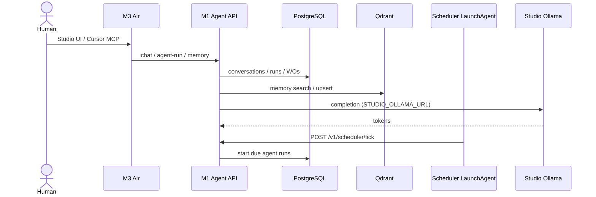
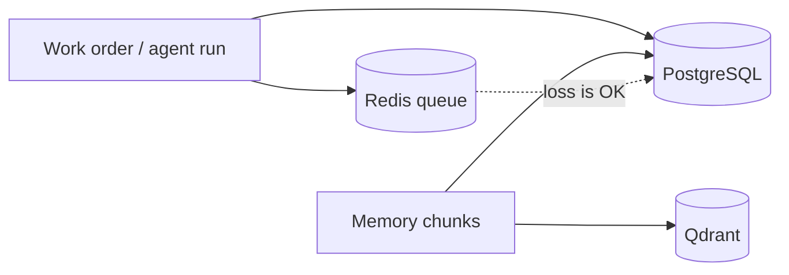

# Data flows

**Status:** Control plane, Studio Ollama/Jupyter, Qdrant memory, scheduler tick,
and lab MCP are **live** (2026-09-24). Studio worker `:8090` and Antares CLI
sandbox are **not** live.

## Personal agent / work order (target + live core)

## Persistence vs cache

## Model bytes

Weights stay on Studio disk (Ollama library; Antares under `~/.ai-lab/antares/`).
Git never sees them. The M1 stores *model ids* and routing policy only.

## Adjacent product data

Clarion / agentic-factory / DefenseClaw data planes are **out of flow** unless a
future work order defines a scoped bridge. Do not pipe production databases into
Qdrant from this repo. See [../inventory/adjacent-systems.md](../inventory/adjacent-systems.md).
