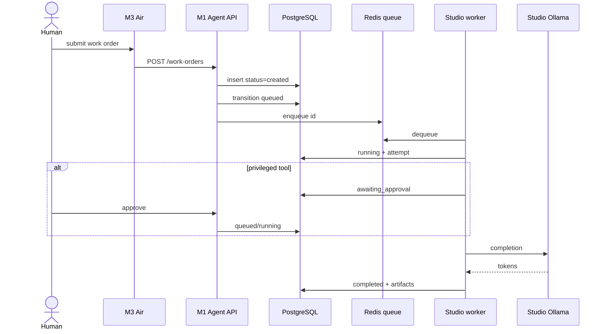
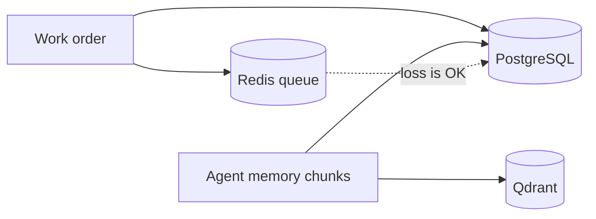

# Data flows

**Status:** Target. Control-plane compose is not running.

## Persistence vs cache

## Model bytes

Weights stay on Studio disk (`$AI_LAB_MODEL_ROOT`, default under a configurable home path). Git never sees them. The M1 stores *model ids* and routing policy only.

## Adjacent product data

Clarion/Oryntra/VolexSwarm data planes are **out of flow** unless a future work order defines a scoped MCP tool. Do not pipe production databases into Qdrant from this repo.
