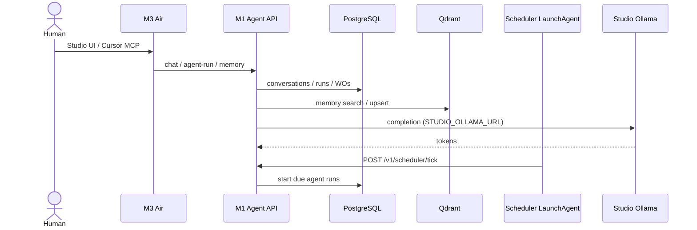
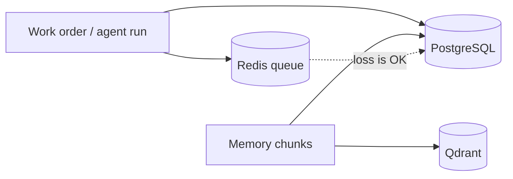

# Data flows

**Status:** Control plane, Studio Ollama/Jupyter, Qdrant memory, scheduler tick,
and lab MCP are **live** (2026-09-24). Studio worker `:8090` and Antares CLI
sandbox are **not** live.

## Personal agent / work order (target + live core)

## Persistence vs cache

## Security plane (direction, ADR 0040)

Usage-billed API calls from the Air and the mini are planned to enter one tailnet gateway. Local Studio completion stays a direct call. DefenseClaw summaries and Antares findings are planned to land on the mini **Security** page. Detail: [security-plane.md](security-plane.md).

## Model bytes

Weights stay on Studio disk (Ollama library; Antares under `~/.ai-lab/antares/`).
Git never sees them. The M1 stores *model ids* and routing policy only.

## Adjacent product data

Clarion production databases stay out of this repo. A DefenseClaw summary, a billed-API gateway, and an Antares job against a read-only snapshot are the scoped bridges in [ADR 0040](../decisions/0040-security-plane-gateway-and-antares.md). They are not built yet, except Antares jobs. Do not pipe adjacent production databases into Qdrant. See [../inventory/adjacent-systems.md](../inventory/adjacent-systems.md).
