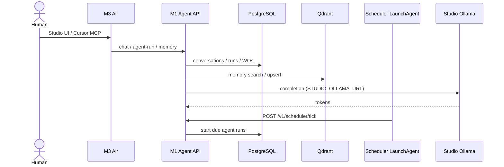
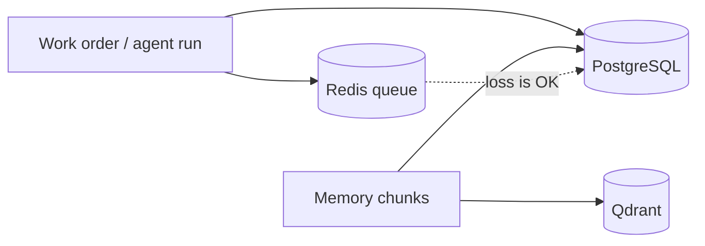

# Data flows

**Status:** Control plane, Studio Ollama/Jupyter, Qdrant memory, scheduler tick,
and lab MCP are **live** (2026-09-26). Studio worker `:8090` is **not** live.
Antares jobs are live and do not survive reboot. A DefenseClaw summary can be
stored on the mini. The billed-API gateway is not built.

## Personal agent / work order (target + live core)

## Persistence vs cache

## Security plane (direction, ADR 0040)

Usage-billed API calls from the Air and the mini are planned to enter one tailnet gateway. That gateway is not built. Local Studio completion stays a direct call to `mac-studio:11434`. DefenseClaw summaries post to the mini **Security** page when the Air report is stored. Antares jobs already return a finding to review. Detail: [security-plane.md](security-plane.md).

## Model bytes

Weights stay on Studio disk (Ollama library; Antares under `~/.ai-lab/antares/`).
Git never sees them. The M1 stores *model ids* and routing policy only.

## Adjacent product data

Clarion production databases stay out of this repo. The scoped bridges in [ADR 0040](../decisions/0040-security-plane-gateway-and-antares.md) are a DefenseClaw summary (one stored on the mini), Antares jobs against a read-only snapshot (live), and a billed-API gateway (not built). Do not pipe adjacent production databases into Qdrant. See [../inventory/adjacent-systems.md](../inventory/adjacent-systems.md).
