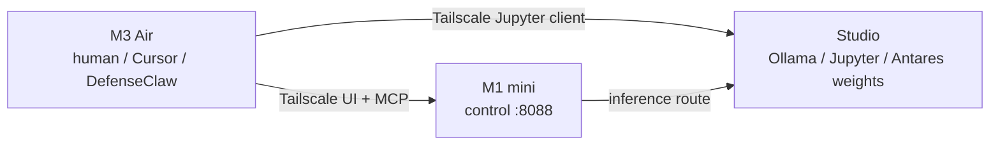
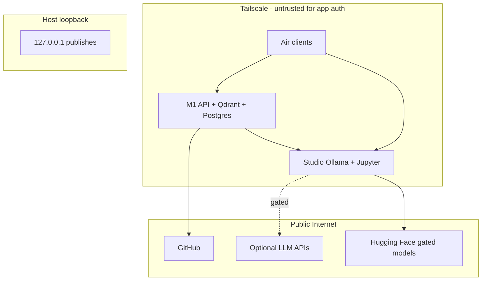
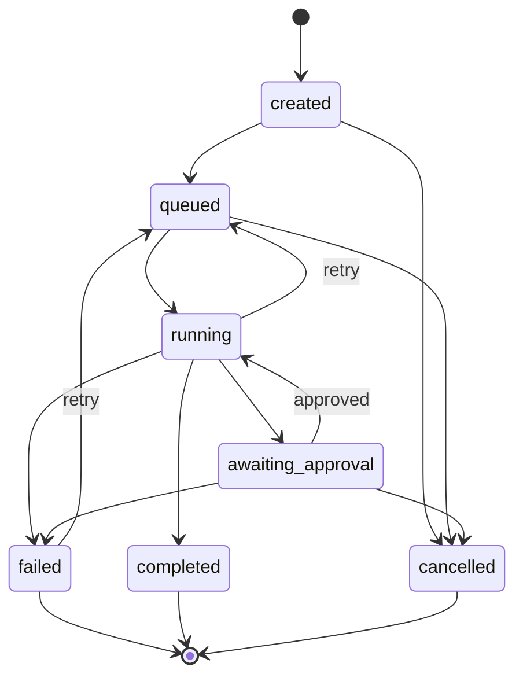
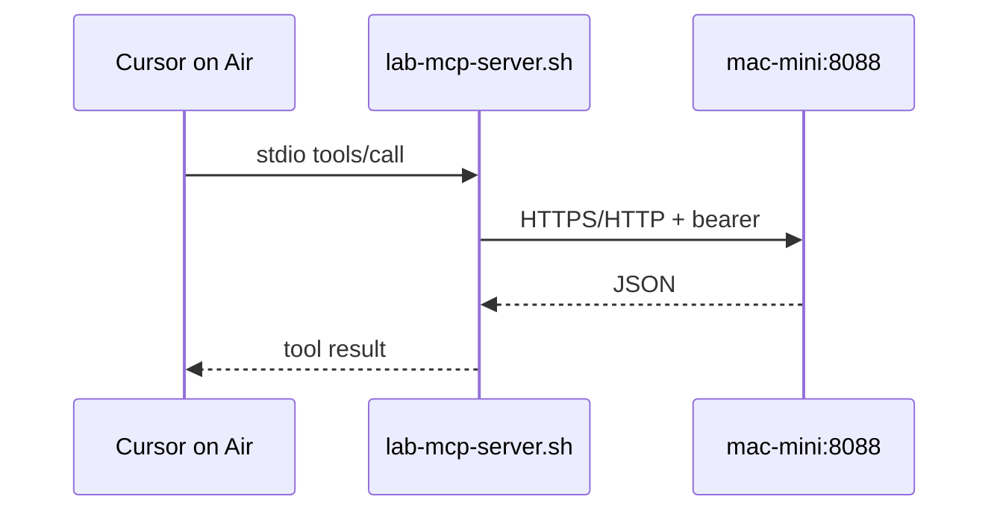

# Diagrams

## Host roles

```mermaid
flowchart LR
  air[M3 Air\nhuman / Cursor / DefenseClaw]
  m1[M1 mini\ncontrol :8088]
  st[Studio\nOllama / Jupyter / Antares weights]
  air -->|Tailscale UI + MCP| m1
  air -->|Tailscale Jupyter client| st
  m1 -->|inference route| st
```

## Trust zones

```mermaid
flowchart TB
  subgraph public [Public Internet]
    gh[GitHub]
    cloud[Optional LLM APIs]
    hf[Hugging Face gated models]
  end
  subgraph tailnet [Tailscale - untrusted for app auth]
    m1[M1 API + Qdrant + Postgres]
    st[Studio Ollama + Jupyter]
    air[Air clients]
  end
  subgraph loopback [Host loopback]
    local[127.0.0.1 publishes]
  end
  air --> m1
  air --> st
  m1 --> st
  m1 --> gh
  st --> hf
  st -.->|gated| cloud
```

## Work-order states

```mermaid
stateDiagram-v2
  [*] --> created
  created --> queued
  created --> cancelled
  queued --> running
  queued --> cancelled
  running --> awaiting_approval
  running --> completed
  running --> failed
  running --> queued: retry
  awaiting_approval --> running: approved
  awaiting_approval --> cancelled
  awaiting_approval --> failed
  failed --> queued: retry
  failed --> [*]
  completed --> [*]
  cancelled --> [*]
```

## Lab MCP (IDE → mini)

```mermaid
sequenceDiagram
  participant Cursor as Cursor on Air
  participant MCP as lab-mcp-server.sh
  participant API as mac-mini:8088
  Cursor->>MCP: stdio tools/call
  MCP->>API: HTTPS/HTTP + bearer
  API-->>MCP: JSON
  MCP-->>Cursor: tool result
```
