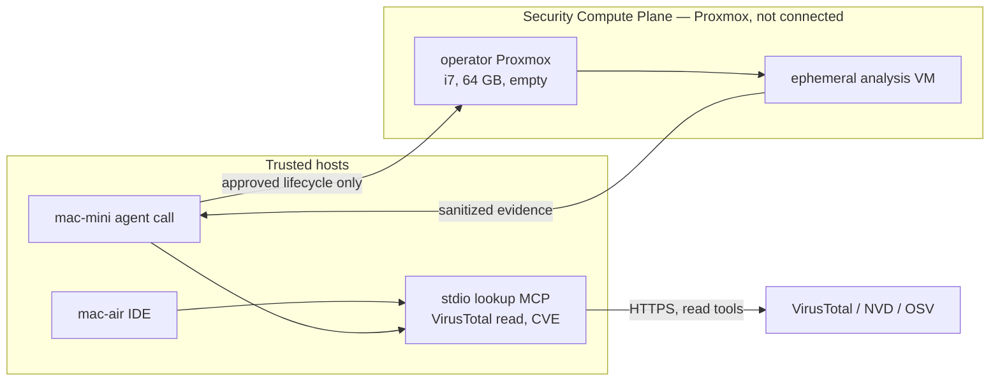

# MCP server placement

**Status:** Direction. Nothing in this page is installed or authorized to run.  
**Updated:** 2026-09-26  
**Intake:** [IWO-079](../work-orders/IWO-079-mcp-server-intake.md)  
**Work orders:** [IWO-080](../work-orders/IWO-080-readonly-third-party-mcp.md), [IWO-081](../work-orders/IWO-081-security-compute-tool-guests.md)

Studio can call two kinds of MCP. They do not share a host.

## Trusted lookup MCP

VirusTotal report lookups and keyless CVE lookups (NVD, OSV, CISA KEV) are HTTPS clients. They run as a stdio process on the trusted host that invokes them: the Air when an IDE launches the process, or the mini when a listed agent calls it.

They do not need Proxmox, ESXi, or a VM. A container is the wrong place for them. The intake in IWO-079 stores a command, declared tools, a network class, and a credential name. The server stays denied until an operator authorizes it. URL submission to VirusTotal and corpus search stay off the first binding. The API key stays in the Keychain or a gitignored env file.

Those clients call the public internet. The intake names that class `public-https`. `GET /v1/mcp/intake` lists `virustotal` and `cve-lookup` with `listed` false. Seeing them in the catalog does not install or authorize them.

Sources reviewed 2026-09-26: [mcpservers.org](https://mcpservers.org/), its [security topic](https://mcpservers.org/topics/security-mcp), the Snyk MCP roundup, and [mcp-virustotal](https://github.com/w0h1v/mcp-virustotal). Snyk's own CLI MCP can wait. It sends source to Snyk, and Antares on the Studio already localizes weaknesses in a snapshot.

## Security Compute tool guests

Active scanners and offensive tool wrappers stay off the Macs. That includes the [FuzzingLabs MCP security hub](https://github.com/FuzzingLabs/mcp-security-hub) and the Snyk roundup entries that drive Nmap, Nuclei, SQLMap, ffuf, masscan, Burp Intruder, Shodan device search, packet capture, or a Kali image. Those projects launch Docker containers. Studio intake rejects a Docker socket. A container on macOS is not a boundary for this work.

If those tools are used later, they run inside an ephemeral guest on the operator's Proxmox server ([D-020](../open-decisions.md), [ADR 0043](../decisions/0043-shared-antares-and-security-compute-plane.md), [FEAT-019](../features/FEAT-019-cybersecurity-vise.md)). The server is an Intel i7 with 64 GB of memory and is empty. Git does not name the host. The guest has one NIC, on an isolated bridge the operator can create, with no route to the Air, the mini, the Studio, or the home LAN ([D-022](../open-decisions.md)). The security agent stays on the mini and talks to the Proxmox API. Evidence that comes back is hashes and normalized records, not a live tool session. Sixty-four gigabytes fits Proxmox plus one or two analysis guests. It does not fit a standing copy of every server on those public lists.

YARA and capa fit that guest later, as evidence classification, not as the first Studio servers.

## What this page does not do

It does not connect to Proxmox, create a VM, install an MCP server, or put a credential in Git. Lookup MCP stays on the trusted side. Tool guests wait until D-021, D-022, and D-024 are operator-supplied.
