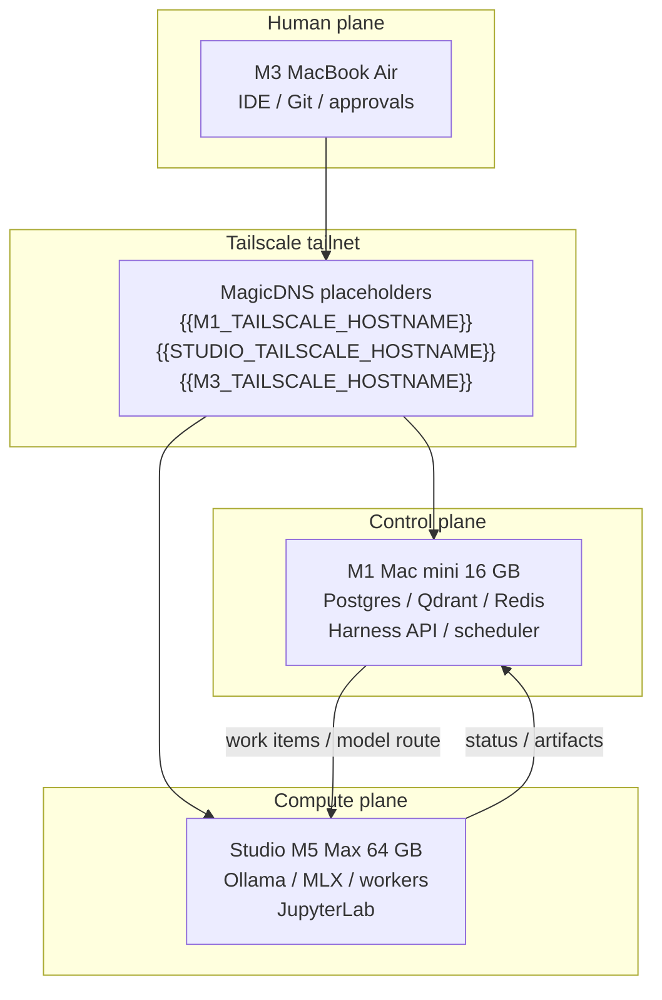

# Architecture overview

**Status:** Target architecture. **Not deployed.**  
**Updated:** 2026-09-20

A personal, three-host Apple Silicon lab with Tailscale as the private network. Durable control-plane state lives on the M1 mini. Inference and training live on the Studio. The M3 Air is the human interface.

## Confirmed hardware

| Inventory name | Machine | Chip | Memory | Disk | Role |
|----------------|---------|------|--------|------|------|
| `m1-mini` | Mac mini | Apple M1 | **16 GB** (confirmed) | 512 GB | Control plane |
| `studio` | Mac Studio | Apple M5 Max, 18 CPU / 40 GPU | **64 GB** (confirmed) | 1 TB | Compute plane |
| `m3-air` | MacBook Air | Apple M3 | **Unconfirmed** | 512 GB | Human plane |

Observed on the workspace host (an M3 Mac, 2026-09-19): `sysctl hw.memsize` = 16 GB. That is **not** owner-attested. Do not size services against it.

## What is implemented in Git vs live

| Piece | In Git | Running on lab hosts |
|-------|--------|----------------------|
| Docs, ADRs, runbooks | Yes | n/a |
| Host Brewfiles + dry-run setup | Yes | **No** |
| Compose Postgres/Redis/Qdrant | Yes | **No** |
| Agent harness + three catalog plans | Yes (deterministic; not LLM) | **No API process** |
| Models | Catalog only | None pulled from this repo |
| Tailscale | Documented | Not configured by this repo |

## Read next

- [control-plane.md](control-plane.md)
- [compute-plane.md](compute-plane.md)
- [agent-platform.md](agent-platform.md)
- [data-flows.md](data-flows.md)
- [diagrams.md](diagrams.md)
- [../deployment/network.md](../deployment/network.md)
