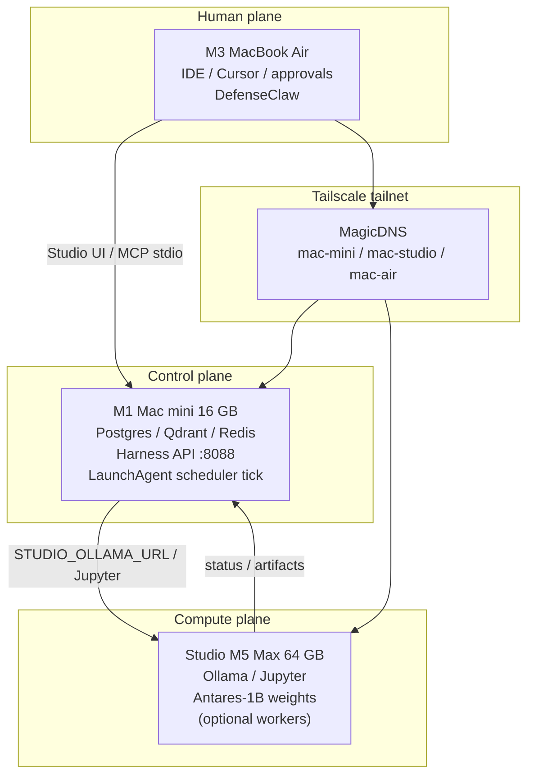

# Architecture overview

**Status:** Control plane live on `mac-mini`; Studio compute (Ollama + Jupyter)
live; Personal Agent Studio + retrieval + scheduler + lab MCP in use. Antares-1B
weights on Studio (serve/CLI sandbox still open).  
**Updated:** 2026-09-24

A personal, three-host Apple Silicon lab with Tailscale as the private network.
Durable control-plane state lives on the M1 mini. Inference and heavy models
live on the Studio. The M3 Air is the human interface (IDE, approvals,
DefenseClaw).

## Confirmed hardware

| Inventory name | Machine | Chip | Memory | Disk | Role |
|----------------|---------|------|--------|------|------|
| `m1-mini` | Mac mini | Apple M1 | **16 GB** (confirmed) | 512 GB | Control plane |
| `studio` | Mac Studio | Apple M5 Max, 18 CPU / 40 GPU | **64 GB** (confirmed) | 1 TB | Compute plane |
| `m3-air` | MacBook Air | Apple M3 | **16 GB** (attested, ADR 0031) | 512 GB | Human plane |

## What is implemented in Git vs live

| Piece | In Git | Running on lab hosts |
|-------|--------|----------------------|
| Docs, ADRs, runbooks | Yes | n/a |
| Host Brewfiles + dry-run setup | Yes | **m1-mini `--apply` done** |
| Compose Postgres/Redis/Qdrant | Yes | **Up on mac-mini** (5432/6379/6333) |
| FastAPI control plane + LangGraph | Yes | **LaunchAgent `com.ai-lab.control-plane` :8088** |
| Personal Agent Studio (`/agents`, login) | Yes | **Live** (operator sessions) |
| Scheduler tick + LaunchAgent | Yes (IWO-030/052) | **`com.ai-lab.scheduler-tick` on mini** |
| Retrieval / Qdrant memory API | Yes (IWO-040/041/053) | **`backend=qdrant` on mini** |
| Lab as MCP server (IDE) | Yes (IWO-042/054) | **Cursor `ai-lab` on Air** |
| DefenseClaw (adjacent) | Preflight docs | **Air: Cursor + Antigravity action** |
| Studio Ollama | Catalog + provider | **`llama3.2:3b` on `mac-studio:11434`** |
| Studio Jupyter | Host scripts | **Up (`:8888`); token on mini** |
| Antares-1B | Runbook + `/antares` UI + jobs | **Live** UI → Studio `:8002` jobs / `:8001` completions |
| Studio SSH | Documented | **OK** — `stevengerhart@mac-studio` from Air and mini (F-015 closed) |
| Studio worker `:8090` | Scripts | **Not running** |
| Cloud LLM / deep research | Gated adapters | Off until `/secrets` authorize |

## Read next

- [control-plane.md](control-plane.md)
- [compute-plane.md](compute-plane.md)
- [agent-platform.md](agent-platform.md)
- [data-flows.md](data-flows.md)
- [diagrams.md](diagrams.md)
- [../deployment/network.md](../deployment/network.md)
- [../inventory/adjacent-systems.md](../inventory/adjacent-systems.md)
