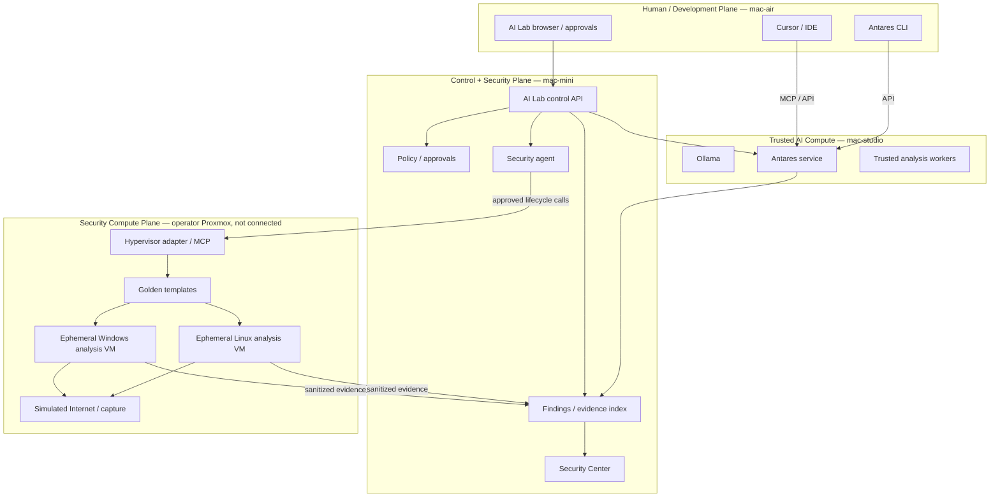

# Security plane amendment — shared development security and Security Compute

**Status:** Proposed
**Decision:** ADR 0043
**Updated:** 2026-09-26

This document amends the current security-plane direction without replacing the
existing control-plane, Agent Studio, or model architecture.

## Target architecture



## Antares service contract

Antares is a shared software-security service.

### Supported request classes

1. `diff_review`
   - selected changed files or patch
   - optimized for developer feedback
2. `repo_review`
   - temporary read-only repository snapshot
3. `cwe_localize`
   - current weakness-class localization behavior

### Interfaces

- HTTP API
- MCP server
- CLI client
- Agent Studio capability

### Required properties

- no repository write capability
- temporary workspace per job
- bounded upload size
- explicit repository / project label
- job identity and audit event
- result schema suitable for IDE rendering
- configurable retention
- source material not committed to Git

## Security Compute Plane

The Security Compute Plane is an external hypervisor environment.

### Trust zones

```text
AI Lab trusted plane
    |
    | authenticated management API only
    v
Hypervisor management
    |
    +---- Golden templates
    |
    +---- Ephemeral analysis VMs
             |
             +---- isolated analysis network
                     |
                     +---- packet capture
                     +---- simulated DNS/HTTP/etc.
                     X---- no tailnet
                     X---- no home LAN
                     X---- no production
```

### VM lifecycle

```text
Validate template
   -> create ephemeral clone
   -> attach analysis-only network
   -> boot
   -> verify tools / sensors
   -> run benign fixture
   -> APPROVAL GATE for untrusted execution
   -> run analysis
   -> collect evidence
   -> stop
   -> revert / destroy
   -> verify no residual VM/disk/network attachment
```

## Security agent

The security agent is an orchestrator, not an unrestricted administrator.

### Default read capabilities

- list approved hypervisors
- list approved templates
- read VM power/state
- read snapshot state
- read approved network attachment
- read datastore capacity
- inspect tool-health signals
- validate cleanup
- collect allowed evidence metadata

### Approval-gated capabilities

- clone/start/stop/revert ephemeral analysis VM
- attach approved analysis network
- invoke guest analysis workflow
- destroy ephemeral VM

### Always separately gated / prohibited by default

- persistent template mutation
- hypervisor host configuration
- virtual-switch / bridge security changes
- firewall changes
- attach to management, home, tailnet, or production network
- public Internet egress
- export suspicious executable to trusted hosts
- run untrusted sample without explicit approval
- modify ESXi/Proxmox credentials

## Evidence path

The trusted Mac hosts should receive evidence, not an infected guest filesystem.

Preferred evidence types:

- hashes
- PE/ELF metadata
- strings
- process tree
- command-line events
- filesystem/registry deltas
- DNS and network metadata
- PCAP
- YARA results
- memory-analysis results
- screenshots
- structured tool output
- selected quarantined artifacts under explicit export policy

AI/LLM analysis consumes this evidence after collection.

## UX integration

The existing Security surface becomes the unified operator view:

- Overview
- Agent security
- MCP / tools
- Antares
- Security Compute
- Vise jobs
- Findings
- Evidence
- Audit
- Policies

Antares remains available outside this UI through MCP/API/CLI.

## Networks and NICs

The operator can create an isolated network on the Proxmox server. Names, addresses, and bridges stay unrecorded until D-021 and D-022 are filled in.

The analysis guest has one NIC. That NIC attaches only to the isolated bridge. The bridge has no uplink and no route to the Air, the mini, the Studio, the home LAN, or the public Internet. A second NIC on that guest, facing a network the Macs can reach, would make the guest a bridge once something inside it is hostile.

The security agent and the job automation stay on the mini. They call the Proxmox API on the host's management path. They do not log into the analysis guest. The Proxmox host is the machine with two attachments: a management interface for that API, and the isolated bridge. Those two attachments do not route to each other.

Evidence leaves through the hypervisor (a guest-agent channel or a disk the host reads after the job), not through an Ethernet path the Macs can open. A second NIC is allowed only while a golden template is being built, and the analysis clone is created without it.

## Reaching the guest

Two hops, and the Mac stops at the first.

1. The security agent on the mini calls the Proxmox API over HTTPS on the host's management interface. That is not the noVNC or SPICE console. Ordinary jobs do not use the console ([IWO-075](../work-orders/IWO-075-cybersecurity-vise-operator-ui.md)).
2. Proxmox opens a virtio-serial pipe into the guest, the QEMU guest agent. The template installs that agent. The pipe is a device between the hypervisor process and a small service in the guest. It is not a NIC, and the mini never opens it.

On that pipe the host checks that the guest is ready and starts the analysis runner baked into the template. It then reads the evidence files the runner wrote, or reads those files from the guest disk after shutdown. The agent on the mini receives the API result. It does not get a shell on the guest. Which of those two read methods the adapter uses is still open. Both stay inside this channel.

## MCP placement

Lookup MCP (VirusTotal read reports, keyless CVE lookups) stays a stdio process on the trusted hosts. Active scanners and offensive tool wrappers stay off those hosts. If they run later, they run in an ephemeral guest on the operator's Proxmox server ([D-020](../open-decisions.md): Intel i7, 64 GB, empty). This amendment does not connect to that server. Detail: [mcp-servers.md](mcp-servers.md).
