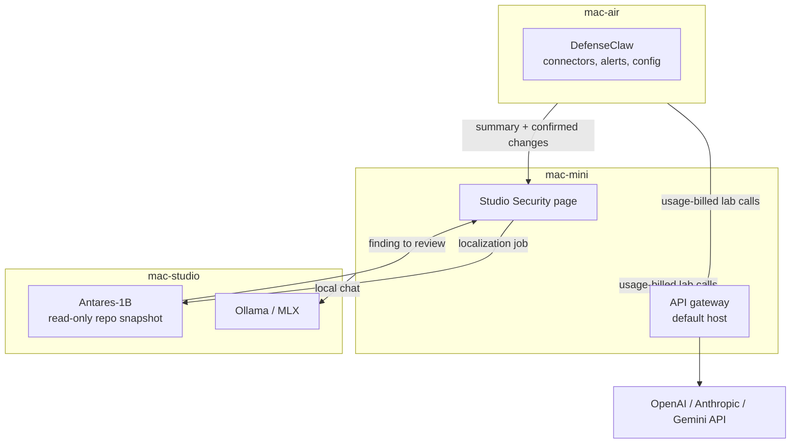

# Security plane

**Status:** Direction accepted ([ADR 0040](../decisions/0040-security-plane-gateway-and-antares.md)). Antares jobs and the DefenseClaw summary are the live slices. The API gateway and config editing are not built.  
**Updated:** 2026-09-26

AI Lab is the security testing ground for this lab. The mini **Security** page is the board. Each tool keeps running on its own host.

## What each tool is for

| Question | Tool |
|----------|------|
| What is the Air enforcing on Cursor and other connectors, and what are the alerts? | DefenseClaw, summarized on **Security** |
| What are the current DefenseClaw settings, and can I change one? | **Security** shows the masked config. Changing it from the page is not built |
| Should this billed model call be allowed, and where did it go? | API gateway |
| Which files in this repo match a weakness class? | Antares on the Studio |

## API gateway

Foundation API calls (`usage_billed_api`) from the mini and the Air go to one gateway on the tailnet. The default host is the mini. Another tailnet device is allowed only when it is the only host that stores the provider keys.

Local Studio inference does not use the gateway. Chat to Ollama stays `mini → mac-studio`.

Keys stay on the gateway host. The page records allow or deny. Billing classes in [ADR 0038](../decisions/0038-model-provider-billing-classes.md) stay in force.

## DefenseClaw

DefenseClaw stays installed on the Air (`~/.defenseclaw`). The lab does not open `defenseclaw tui` inside the browser. **Security** is the page for status, activity, alerts, and masked configuration.

The Air pushes a summary. If that push stops, the card shows stale. Config files, the device key, and the audit database stay on the Air and out of Git. Finding rows pick up a short explanation from the lab glossary when the page renders them. Each recent block also says whether that step ran and whether the same turn kept going and ended. A turn end means the agent finished a reply. It does not mean the coding task was correct. **Explain with the lab model** rephrases that card. The match text stays on the Air.

## Antares

Antares-1B is the localization model on the Studio. You name a weakness class and a read-only snapshot. It returns files a person should review. The live check is the CWE-78 fixture, which points at `app.py`. The UI is `/antares`, linked from **Security**.

Use it on a repo by placing a read-only copy on the Studio and starting a job. That includes this lab. It also includes an adjacent product such as Clarion: copy the snapshot you want inspected, run the job, review the paths. Clarion’s compose stack, Vault, and repo stay outside this tree ([ADR 0025](../decisions/0025-clarion-adjacent-only.md)).

Antares does not patch the code and does not scan a whole product the way an application scanner would. A broader software scan is a later tool on this same page, not a new meaning for Antares.

## What is live today

| Piece | Live |
|-------|------|
| **Security** page with an Antares badge | Yes |
| Antares jobs and completions on the Studio | Yes. Jobs do not survive reboot until LaunchAgents are set |
| DefenseClaw on the Air | Yes. One summary is stored on the mini (2026-09-25). A later push is `./scripts/defenseclaw-report.sh --apply`, which still needs `~/.ai-lab/api.token` on the Air. The Findings pane was not checked in a browser |
| API gateway | No |
| Choosing an arbitrary repo, including Clarion, from **Security** | No. Jobs use the configured Studio repo path |
